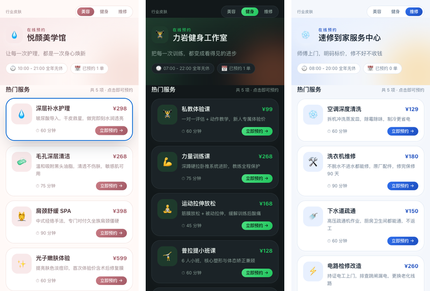
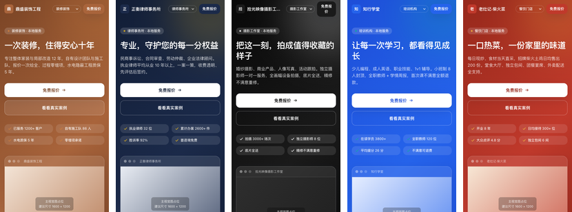
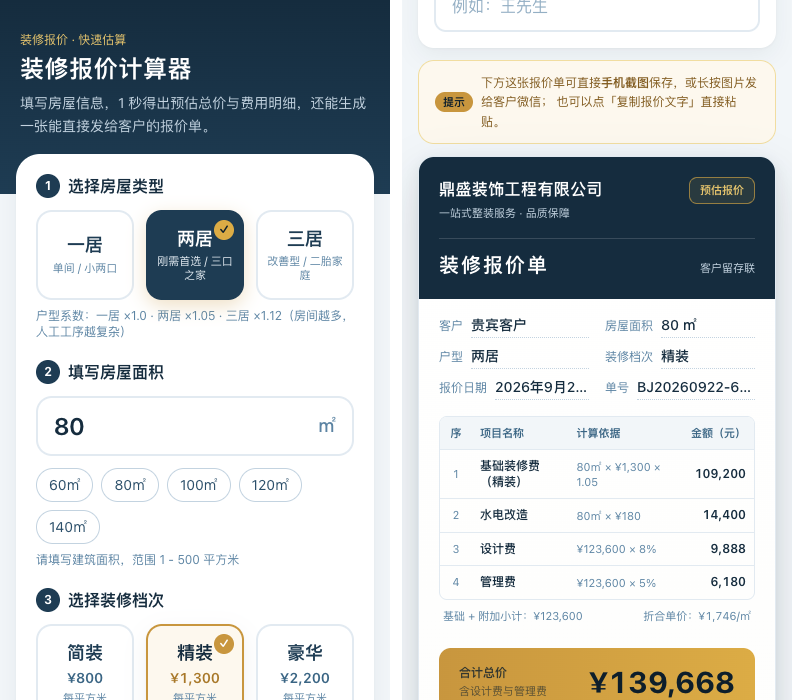

# 本地商家网页模板套件

> Three ready-to-use frontend templates for local businesses: booking system, landing page, quote calculator.
> 纯前端、无后端、无登录，手机上打开就能用。**改一个配置文件就能换一整个行业。**

[](./LICENSE)
[](https://kotochain.github.io/local-shop-web-templates/)

## 在线预览

| 模板 | 预览 | 说明 |
|---|---|---|
| **预约系统** | [美容](https://kotochain.github.io/local-shop-web-templates/booking-app/?industry=beauty) · [健身](https://kotochain.github.io/local-shop-web-templates/booking-app/?industry=gym) · [维修](https://kotochain.github.io/local-shop-web-templates/booking-app/?industry=repair) | 一套代码三套皮肤 |
| **官网落地页** | [装修](https://kotochain.github.io/local-shop-web-templates/landing-page/?industry=renovation) · [律所](https://kotochain.github.io/local-shop-web-templates/landing-page/?industry=law) · [摄影](https://kotochain.github.io/local-shop-web-templates/landing-page/?industry=photography) · [培训](https://kotochain.github.io/local-shop-web-templates/landing-page/?industry=training) · [餐饮](https://kotochain.github.io/local-shop-web-templates/landing-page/?industry=restaurant) | 一套模板五个行业 |
| **报价计算器** | [打开](https://kotochain.github.io/local-shop-web-templates/quote-calculator/) | 实时出报价单 |

建议用手机打开，或在浏览器里切到手机模拟（宽 390px）。



## 这个项目解决什么

本地小商家（美容院、健身房、维修店、装修公司……）想要一个"能在线预约 / 有个官网 / 能自动报价"的网页，但：

- 现成 SaaS 按月收费，功能用不上还要交钱
- 找人定制开发动辄几千上万
- 自己不会写代码，网上的模板又改不动

这三个模板的定位是：**改一个文件就能交付给不同行业的商家**。所有文案、价格、营业时间、服务项目、整套配色都在一个配置文件里，不懂代码也能改。

## 三个模板

### ① 在线预约系统 `booking-app`

适合美容、美甲、理发、SPA、健身、瑜伽、私教、家电维修、家政。

- 服务卡片：名称、时长、价格、卖点
- 点服务 → 弹出预约表单：选日期（未来 7 天）+ 选时间段
- 可选时段按 **营业时间 + 服务时长** 自动排档
- **冲突检测**：同一天同一时段被约走自动置灰，包含跨时段重叠判定（60 分钟服务会占掉两个 30 分钟档）
- **今天已过去的时段自动失效**（含提前量）
- 手机号格式校验、必填校验、手机号中间四位打码
- "我的预约"列表，支持取消并释放时段
- 数据存 localStorage，按行业隔离，关掉浏览器再打开还在
- 三套行业皮肤，URL 参数切换：`?industry=beauty` / `gym`（等同 `fitness`）/ `repair`

### ② 企业官网落地页 `landing-page`

适合装修公司、律所、摄影工作室、培训机构、餐饮门店。

- 首屏 + "免费报价"按钮（平滑滚动到表单）
- 服务项目 4 卡片 / 案例展示 6 宫格（悬停浮出说明）/ 客户评价 3 条
- 联系表单（前端校验，提交后提示"我们会尽快联系您"）
- 底部：电话、微信、地址、营业执照号占位
- 吸顶导航，滚动后自动出现
- 五套行业配置：`?industry=renovation` / `law` / `photography` / `training` / `restaurant`
- 配色全部走 CSS 变量，改一个值全站生效



### ③ 报价计算器 `quote-calculator`

适合装修公司、建材、设计工作室。换成别的单价也能做物流运费、广告预算。

- 选户型 / 填面积 / 选档次 / 勾附加项
- **改任一参数实时出总价和明细**，每项写清计算依据
- 生成报价单：正式单据排版的大卡片，方便截图发给客户
- 单价全部常量化，集中在 `src/config/pricing.js`
- 明细以加总为准，避免四舍五入误差



## 快速开始

```bash
git clone https://github.com/kotochain/local-shop-web-templates.git
cd local-shop-web-templates

# 以预约系统为例
cd booking-app
npm install
npm run dev      # 本地开发，浏览器打开提示的地址
npm run build    # 打包产出 dist/
```

三个模板互相独立，可以只取其中一个用。

## 怎么改成你自己的店（不用写代码）

| 模板 | 改这个文件 | 能改什么 |
|---|---|---|
| 预约系统 | `src/config/industries.js` | 店名、标语、营业时间、服务列表 / 时长 / 价格、整套配色 |
| 落地页 | `src/config/industries.js` | 公司名、价值主张、服务、案例、评价、联系方式、整套配色 |
| 报价计算器 | `src/config/pricing.js` | 全部单价、户型系数、附加项价格、公司信息 |

配色是"一处改、全站变"——主题色通过 CSS 变量注入，Tailwind 里映射成 `bg-brand` / `text-brand` 这类语义类名，组件本身不含硬编码颜色。

## 部署

三个模板都是纯静态产物，`npm run build` 后得到 `dist/` 目录：

- **Netlify**：把 `dist` 文件夹拖到 [app.netlify.com/drop](https://app.netlify.com/drop)
- **Vercel**：`vercel deploy`
- **GitHub Pages**：本仓库自带 Actions 工作流（`.github/workflows/deploy-pages.yml`），推到 `main` 自动构建并部署三个模板到同一个站点

vite 的 `base` 配的是 `./`，所以放在任意子路径下都能正常加载。

## 目录结构

```
.
├── booking-app/        在线预约系统（3 套行业皮肤）
├── landing-page/       企业官网落地页（5 套行业配置）
├── quote-calculator/   报价计算器
├── portal.html         GitHub Pages 首页（三个模板的导航）
├── 作品集/             作品集文档 + 商品图 + 截图
└── .github/workflows/  自动部署到 Pages
```

每个子目录都自带 README，说明启动、改文案、部署的具体步骤。

## 技术栈

Vite 5 + React 18 + Tailwind CSS 3.4。零后端、零数据库、零第三方服务依赖。

## 已知限制

- 预约数据存在浏览器 localStorage，**换设备不同步、清除缓存会丢失**。要做"商家后台能看到所有订单"需要接后端，这是另一个需求。
- 没有任何后端校验，表单数据不上传服务器，适合做演示和轻量使用，不适合承载真实交易。

## 关于同步代码（网络受限时看这里）

推 GitHub 走的是 HTTPS，`git push` 如果被网络阻断，用仓库自带的同步脚本，它走 GitHub API 通道：

```bash
python3 tools/sync-to-github.py
```

脚本会自动比对本地已跟踪文件和远端仓库的差异，**只上传缺失或变动的文件**，重复运行不会有副作用。依赖两个前提：`gh auth login` 已登录，且脚本顶部的 `REPO` 指向你自己的仓库。

## License

Copyright (c) 2026 kotochain · [PolyForm Noncommercial 1.0.0](./LICENSE)

**非商业许可**，大白话版：

- ✅ 可以：学习、研究、改造，自己非商业地使用（个人作品、公益项目、内部演示）
- ❌ 不可以：把代码或基于它的作品**拿去商用、转售、接单交付给客户**——包括把改了个配色的版本当成自己的作品卖
- 💼 商业使用需要作者授权，授权方式见下方

## 商业授权 / 定制服务

如果你想把这个模板用于商业用途（比如给你的店铺上线、给客户交付），或者需要按你的行业定制功能，联系作者获取授权：

<!-- 在这里填你的联系方式，例如：闲鱼搜索「你的闲鱼昵称」 / 微信：xxxxxx -->

---
